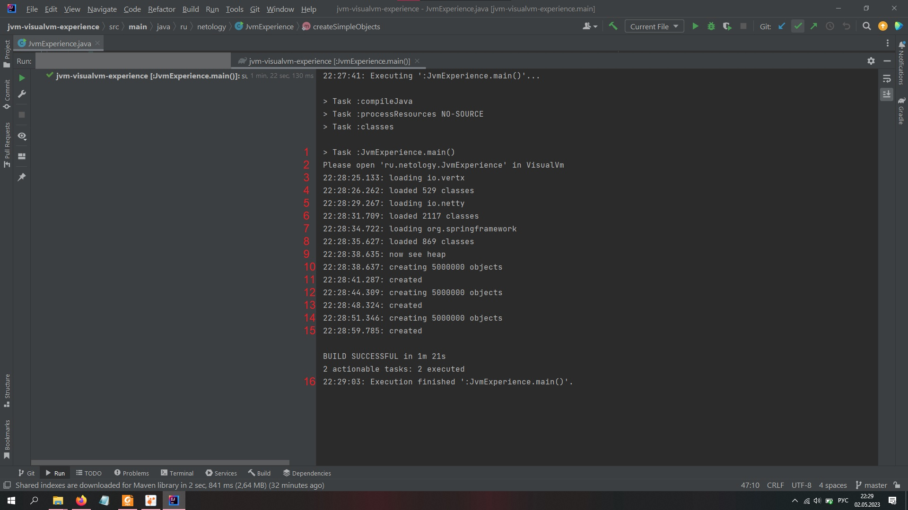
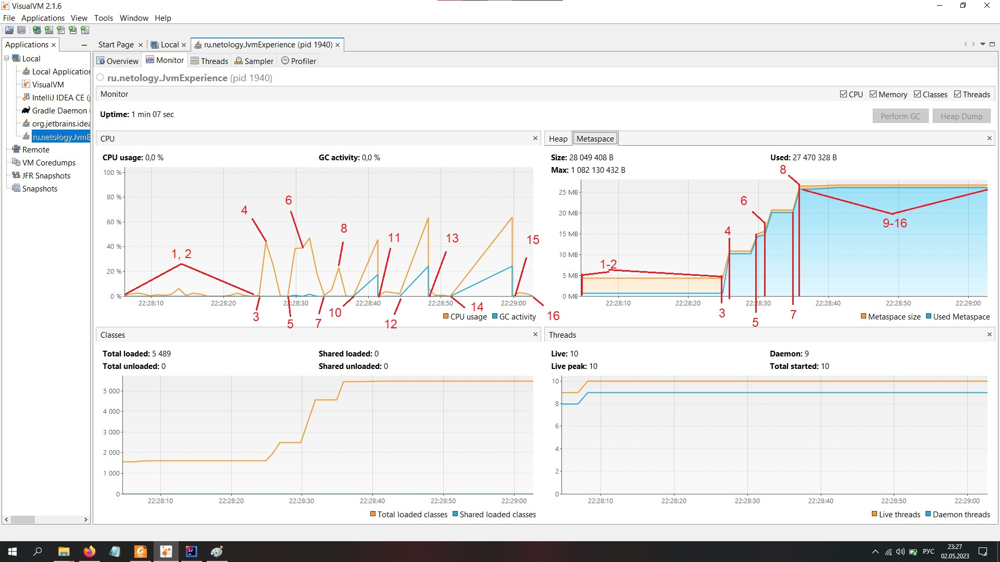
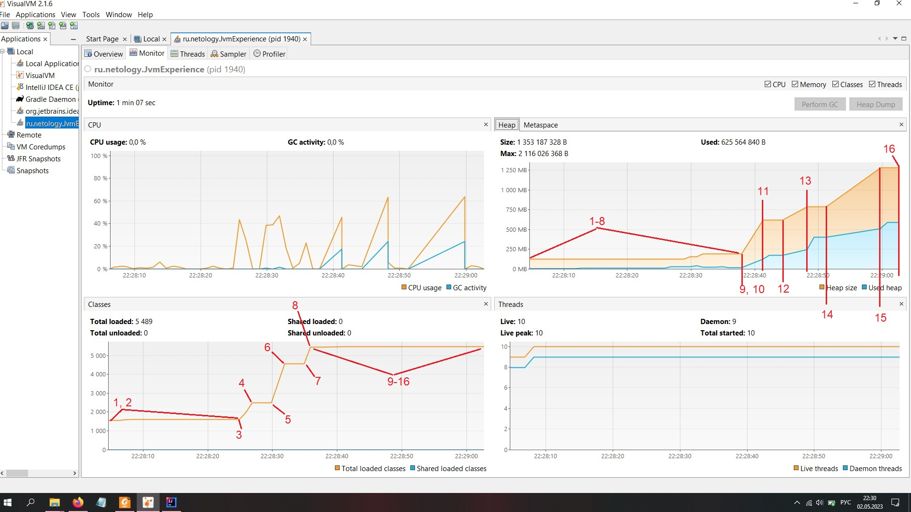

#Исследование JVM через VisualVM
Вывод консоли в результате работы программы:

Скриншоты из VirtualVM:
* Нагрузка на CPU и заполнение Metaspace

* Количество классов и заполнение Кучи

Во время вывода строк 3-8 происходит загрузка классов в три этапа с перерывами в 3 с. Каждый этап сопровождается ростом нагрузки на CPU с последующим сбросом нагрузки по завершении этапа, а также ступенчатым ростом графика загруженных классов и использования Metaspace, где хранятся метаданные загружаемых классов. Загрузка Metaspace сохраняется до конца работы программы и не зависит от работы Garbage Collector (сборщик мусора, GC).

Во время вывода строк 10-15 происходит создание объектов в три этапа с перерывами в 3 с. Каждый этап сопровождается аналогичным ростом нагрузки на CPU от работы программы и от параллельной работы GC, а также ступенчатым ростом графика загрузки Кучи.
Примечательно, что загрузка Кучи также сохраняется до конца работы программы и не снижается при работе GC. Это обусловлено тем, что в Стеке сохраняется ссылка на созданные объекты - список simpleObjects.